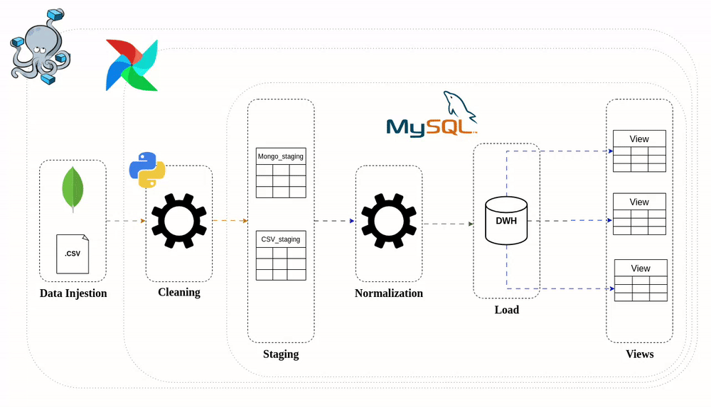
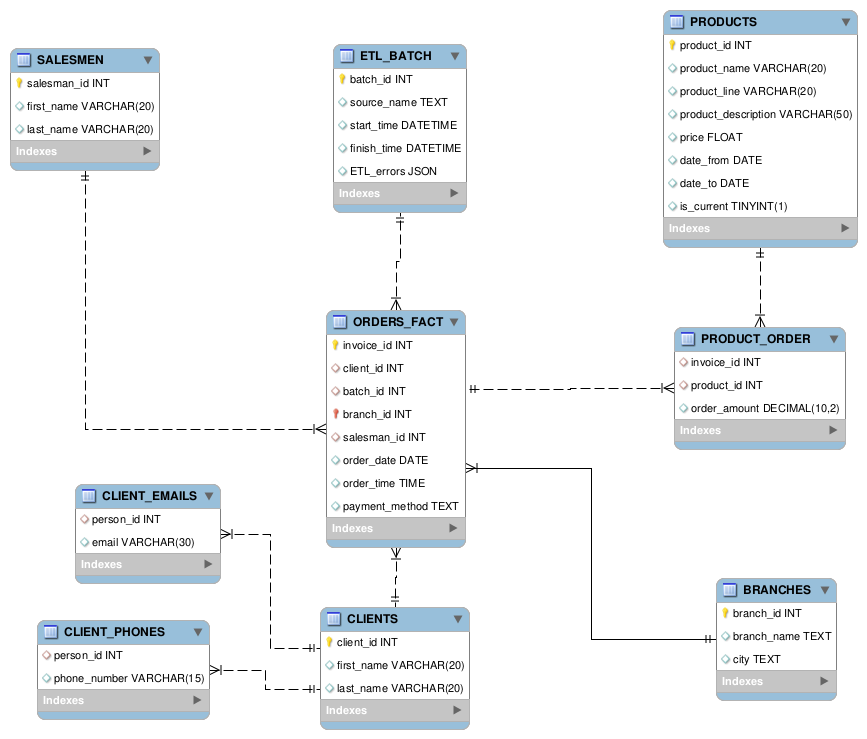
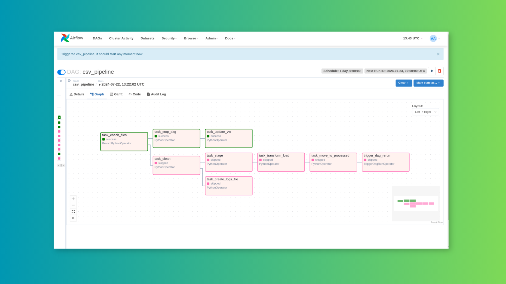
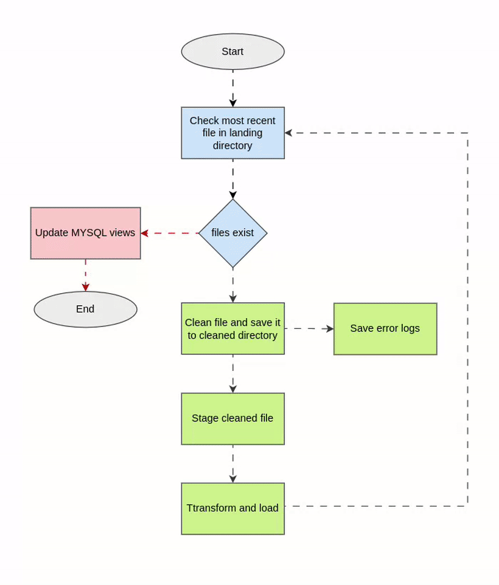
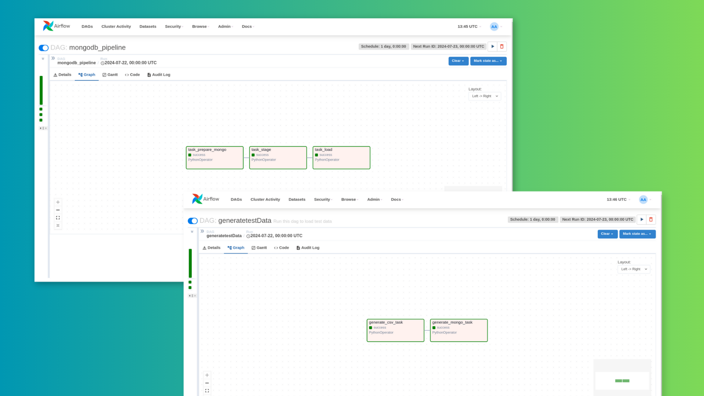

# Sales Data Pipeline


This repository implements a simple data pipeline for csv and MongoDB data sources using Airflow for worfkflow management and data warehouse concepts such as slowly changing dimensions, data cleaning, and analytical views.
# What is New
* Utilized MySQL stored procedures in `ETL` process.
* DWH database is initialized automaticly on container build.
* Logging errors to `JSON` files in processing area.
# Desired Outcomes
* Create synthesized datasets to test the pipeline using the Faker module.
* Implement a DWH using Mysql server.
* Build a data pipeline to store incoming CSV data.
* Separate cleaned CSVs from dirty CSVs by managing directories.
* Build a data pipeline to store incoming transaction data.
* Apply the slowly changing dimension technique to track products prices changes.
* Utilize Airflow for orchestration and automate cleaning, loading, and error log reports.
* Containerizing the pipeline using docker compose.

# Source Data Examples
## CSV Source
```
Invoice_ID,Branch,City,First_name,Last_name,Salesman_firstname,Salesman_lastname,Email,Phone_number,Product,Product_line,Unit_price,Quantity,Date,Time,Payment
214,C,Chicago,Alice,Johnson,Sam,Blue,alice.johnson@example.com,456-789-1234,Smartphone,Electronics,699.99,8,2023-04-07,04:22:09,Credit Card
1700,B,Los Angeles,John,Doe,James,Black,john.doe@example.com,123-456-7890,Smartphone,Electronics,699.99,5,2023-11-29,00:40:07,Credit Card
2662,A,New York,Alice,Johnson,Tom,Brown,alice.johnson@example.com,456-789-1234,Jeans,Clothing,60.0,5,202403-02,01:25:37,Cash
```
## MongoDB Source
```json
// transactions.invoices document structure example
{
  "_id": {
    "$oid": "669e8dc0178c8d965f3b3c58"
  },
  "user": {
    "first_name": "Jane",
    "sure_name": "Smith",
    "username": "JaneSmith",
    "email": "jane.smith@example.com",
    "phone_number": "987-654-3210"
  },
  "invoices": [
    {
      "invoice_id": 4828,
      "payement_method": "Credit Card",
      "products": [
        {
          "product_name": "Jeans",
          "product_line": "Clothing",
          "product_description": null,
          "price": 49.99,
          "quantity": 10
        }
      ],
      "date": "2023-09-02",
      "time": "16:04:32"
    },
    {
      "invoice_id": 438,
      "payement_method": "E-wallet",
      "products": [
        {
          "product_name": "Jeans",
          "product_line": "Clothing",
          "product_description": null,
          "price": 49.99,
          "quantity": 6
        },
        {
          "product_name": "Pizza",
          "product_line": "Food",
          "product_description": null,
          "price": 9.99,
          "quantity": 7
        },
        {
          "product_name": "Pizza",
          "product_line": "Food",
          "product_description": null,
          "price": 9.99,
          "quantity": 7
        }
      ],
      "date": "2023-07-17",
      "time": "05:24:35"
    },
    {
      "invoice_id": 927,
      "payement_method": "E-wallet",
      "products": [
        {
          "product_name": "Pizza",
          "product_line": "Food",
          "product_description": null,
          "price": 9.99,
          "quantity": 1
        },
        {
          "product_name": "Jeans",
          "product_line": "Clothing",
          "product_description": null,
          "price": 49.99,
          "quantity": 3
        }
      ],
      "date": "2023-12-13",
      "time": "11:13:46"
    }
  ]
}
```
# The Dataware House

This Data Warehouse (DWH) schema is designed to manage and analyze sales data. It includes dimension tables for clients, salesmen, products, prices, branches, and ETL batches, which store descriptive attributes. The fact table, ORDERS_FACT, stores transactional data related to orders. Additional tables for error codes, client contact details, and product orders support data quality and relationship management.
# Pipelines
## CSV Pipeline

The pipeline loops on incoming csv files in the landing directory every day. If it finds any files, it cleans it, log errros, starts ETL process, then triggers itself to re-run until the landing directory is empty.
    
### Error Example
``` json
// error example
[
    {
        "index": 1,
        "column": "Branch",
        "error_type": "missing_value"
    },
    {
        "index": 3,
        "column": "Branch",
        "error_type": "missing_value"
    },
    {
        "index": 7,
        "column": "Date",
        "error_type": "invalid_date"
    },
    {
        "index": 13,
        "column": "Phone_number",
        "error_type": "invalid_phone"
    },
    {
        "index": 9,
        "column": "Unit_price",
        "error_type": "negative_value"
    }
]
```
********
## MongoDB Pipeline and Test Data Generation Task

MongoDB pipeline simply unwind it's data untile it matches staging tables schema, then stages it.
# Project Directory Structure
```
.
├── airflow.cfg
├── ASSETS
│   ├── CSV_pipeline.png
│   ├── erd.png
│   ├── flow_diagram.gif
│   ├── Generate_test_data_and_MongoDB_pipeline.png
│   ├── Generate_test_data.png
│   ├── MongoDB_pipeline.png
│   └── workflow.gif
├── dags
│   ├── common
│   │   ├── dataGenerator
│   │   │   ├── faker_provider.py
│   │   │   └── generator.py
│   │   ├── global_vars
│   │   │   ├── general_global_var.py
│   │   │   └── mongo_global_var.py
│   │   ├── modules
│   │   │   ├── airflow_file_handler.py
│   │   │   ├── data_processing.py
│   │   │   ├── dwhInterface.py
│   │   │   └── mysql_handler.py
│   │   └── scripts
│   │       ├── csv_cleaning.py
│   │       └── mongoInvoices.py
│   ├── csv_pipeline.py
│   ├── generate_testData.py
│   ├── mongodb_pipeline.py
├── dataGenerator
├── docker-compose.yaml
├── dockerfile
├── dwh-SQL
│   ├── 1-dwh-tables-init.sql
│   ├── 2-StoredProc.sql
│   └── 3-update_view.sql
├── README.md
├── requirements.txt
├── setup.sh
└── STAGES
    ├── CLEANED
    │   ├── cleaned_2024-07-23 12:43:41.847558.csv
    │   └── cleaned_2024-07-23 14:40:20.065539.csv
    ├── LANDED
    │   ├── 2024-07-23 12:43:41.847558.csv
    │   └── 2024-07-23 14:40:20.065539.csv
    └── PROCESSED
```